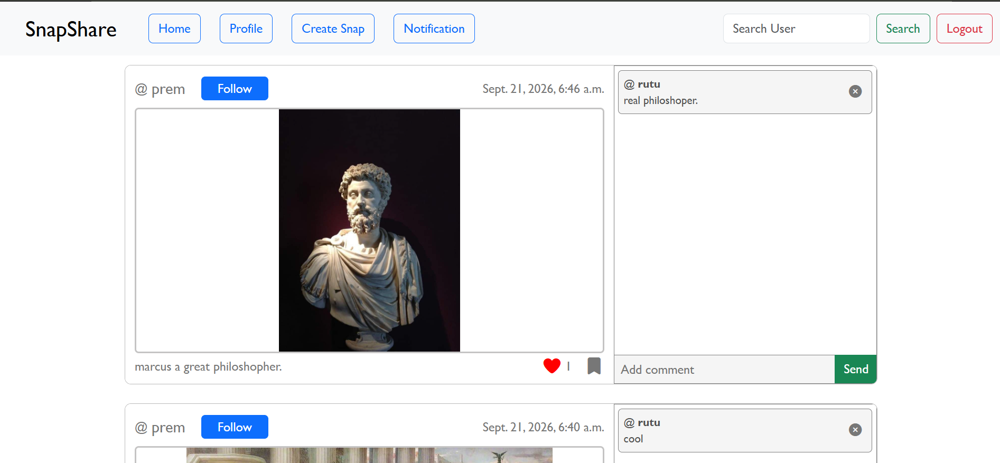
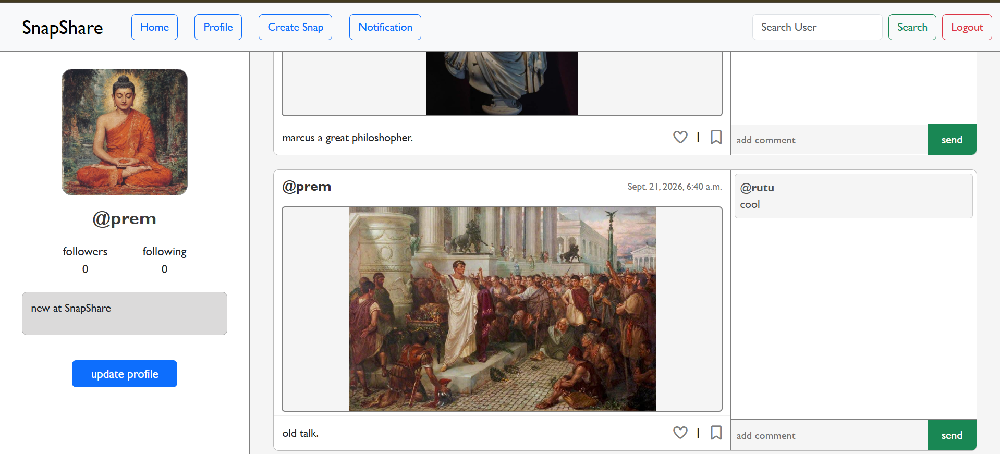
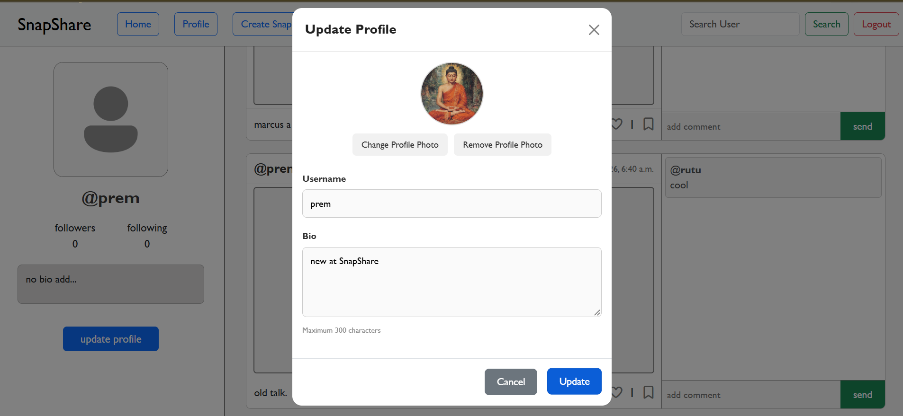
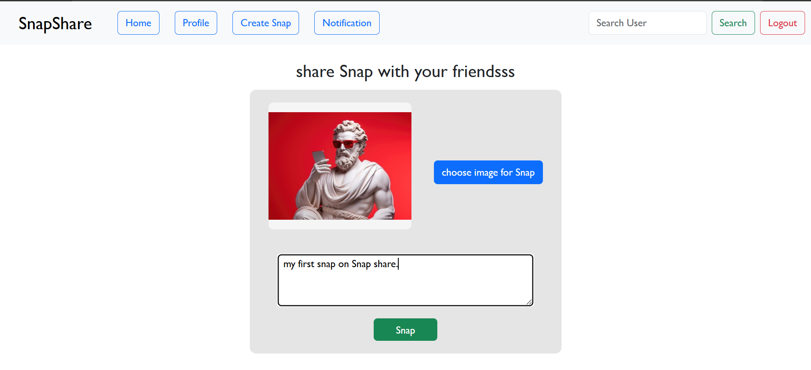
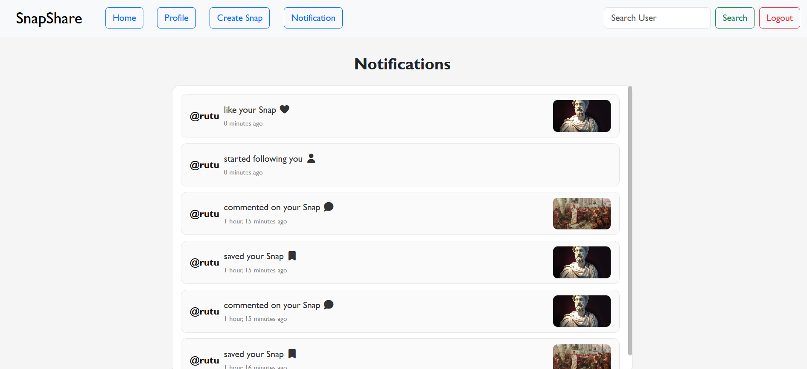

# 📸 SnapShare

A social media web application built with Django where users can share photos, follow other users, like posts, comment, save posts, and manage their profiles.

## ✨ Features

- 👤 User registration and login
- 📸 Upload posts with captions
- ❤️ Like posts
- 💬 Comment on posts
- 🔖 Save posts
- 👥 Follow and unfollow users
- 🔔 Notifications
- 👤 User profiles
- 🔍 Search users
- 🖼️ Profile pictures
- 📱 Responsive UI

## 🛠️ Technologies

- 🐍 Python
- 🌐 Django
- 🎨 HTML
- 🎨 CSS
- 🅱️ Bootstrap
- 🗄️ SQLite

## Screenshots

### Home



### Profile



### Update Profile



### Create Post



### Notification



### Search User


## 🚀 Installation

### 1. Clone the repository

```bash
git clone https://github.com/YOUR_USERNAME/YOUR_REPOSITORY.git